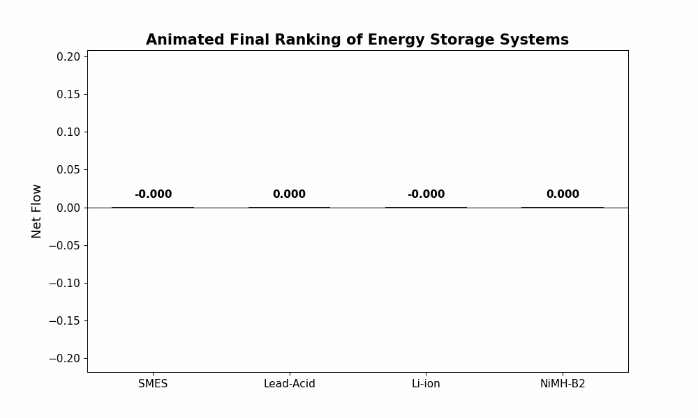

# ML-CB-Bipolar-L-Fuzzy-Rough-PROMETHEE

This repository contains the implementation of a machine learning-enhanced PROMETHEE model using a Covering-Based Bipolar L-Fuzzy Rough Set approach for evaluating battery energy storage systems (BESS) in renewable energy projects.

🔬 This code supports the case study presented in the published article:  
**"An Enhanced Machine Learning Covering-Based Bipolar L-Fuzzy Rough Set PROMETHEE Model for Battery Storage Systems in Renewable Energy"**, published in *Expert Systems with Applications* (Elsevier).  
DOI: 10.1016/j.eswa.2025.127951

---

## ✨ Highlights

- 📊 Uses Random Forest to compute criteria weights from data  
- 🔁 Applies Covering-Based Bipolar L-Fuzzy Rough Sets for modeling uncertainty  
- ⚖️ Uses PROMETHEE for preference ranking and decision-making  
- 🔌 Real-world application for evaluating battery storage systems in renewable energy

---

## 📁 Files

- `ml_promethee_decision_model.ipynb`: Main Jupyter notebook with full workflow  
- `requirements.txt`: Python libraries needed to run the notebook  
- `graph.png`: Graphical figure used in the paper (optional)  
- `output.gif`: Animated decision visualization (optional)

---

## 🧠 Methodology Workflow

1. **Random Forest** is trained on input data to determine feature importance (criteria weights)  
2. **Covering-Based Bipolar L-Fuzzy Rough Sets** are used to model uncertainty and derive approximations  
3. **PROMETHEE** is applied to generate preference flows and rankings for decision alternatives

---

## 🚀 How to Run

1. Clone the repository:  
   ```bash
   git clone https://github.com/Faiza-Tufail/ML-CB-Bipolar-L-Fuzzy-Rough-PROMETHEE.git
   cd ML-CB-Bipolar-L-Fuzzy-Rough-PROMETHEE

   ```

2. Install required libraries:  
   ```bash
   pip install -r requirements.txt
   ```

3. Launch the Jupyter notebook:  
   ```bash
   jupyter notebook ml_promethee_decision_model.ipynb
   ```

4. Follow the notebook cells to run the analysis and reproduce the results.

---

## 📚 References

- Faiza Tufail et al., *An Enhanced Machine Learning Covering-Based Bipolar L-Fuzzy Rough Set PROMETHEE Model for Battery Storage Systems in Renewable Energy*, Expert Systems with Applications, 2025.  
DOI: [10.1016/j.eswa.2025.127951](https://doi.org/10.1016/j.eswa.2025.127951)

---
## 🔋 Normalized Performance of Different Batteries

The following graph shows the normalized performance of various battery storage systems based on selected evaluation criteria.


---

## 🏆 Final Ranking for Best Battery (Random Forest)

The animation below demonstrates how the Random Forest model contributes to the final ranking of the most suitable battery for renewable energy systems.


## 📝 License

This repository is licensed under the MIT License.

---

## 🙋 Contact

For questions or feedback, please contact Faiza Tufail at faizatufail85@gmail.com.
